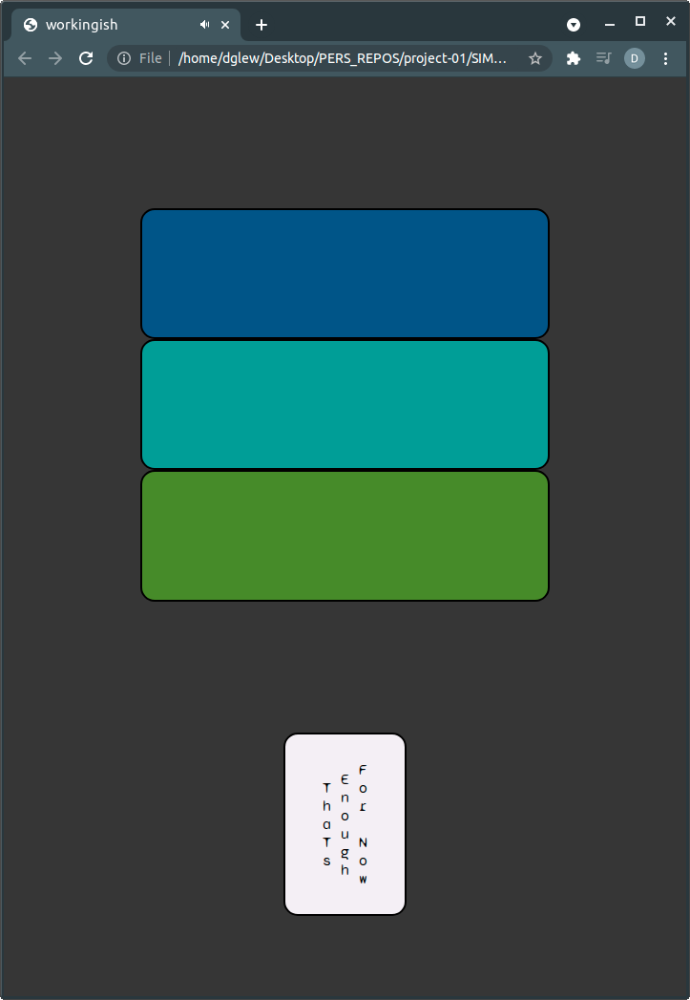

# 

## Description

A 5 Button memory procession attempting to be engaging and rewarding while minimizing the frustration augmenting aspects of similar games.
In the current state a "Win" can be achieved after 7 rounds.

## Screenshots of Game

## technologies used
* HTML
* CSS
* JavaScript

## sounds 

## Getting Started
please click on this link to start the game:
* https://dglew-p.github.io/Project-01/

## Planning For Future enhancement

1) Implement toggle between win / loss  and continuous play to incorporate some principles of Flow. The basic function would remove the round limit for a win and only shorten the next sequence on an incorrect guess .
* https://en.wikipedia.org/wiki/Flow_(psychology)
* https://en.wikipedia.org/wiki/Dynamic_game_difficulty_balancing
2) Implement variable sequence speed dependant on round of play.
3) Improve sound quality on mobile

